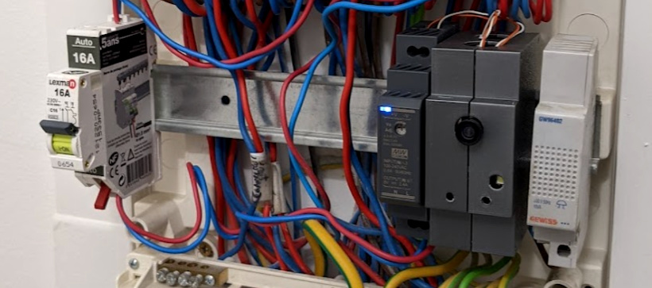

# ESP32 DIN CCTV

**🚧 Work in progress / more details / code / stuff coming soon 🚧**

50€ DIN-rail compatible WiFi security camera with additional features (doorbell detection, magnetic / reed switch door & PIR sensor...) that sends you alerts on Telegram if someone unauthorised breaks into your house.

## Embedded software

Project is based on the Arduino framework (C++), with the *PlatformIO Visual Studio Code* add-on.

## Build it

I wanted to keep it simple, hence it's using the well known **AI-Thinker ESP32-CAM board**. I'm using the 120°  wide lens, so my entrancy / hallway can be seen in one sight.

The module is designed to be integrated into your electric panel, fixed on a standard DIN rail for direct wall mounting.

3D printed parts have been designed with *OpenSCAD*, which is an open-source software that helps create parts with just code. Easy to change, easy to share.

`*.stl` and `*.scad` files are stored under the `/mechanical` folder.

The module is powered thanks to a DIN-rail AC/DC 15W 5VDC converter, **MeanWell HDR-15-5**.

You might / *need* to add a 10A circuit breaker, connected upstream of the 5V power supply.

`[Schematic incoming...]`