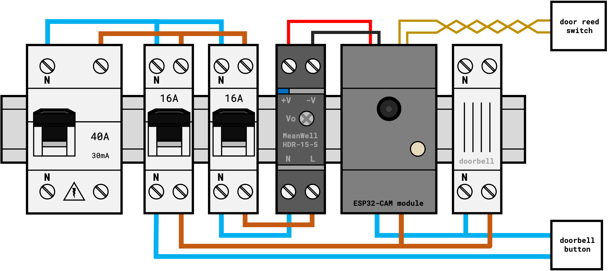

# ESP32 DIN CCTV

**🚧 Work in progress / more details / code / features coming soon 🚧**

40€ DIN-rail compatible WiFi security camera with additional features (doorbell detection, magnetic / reed switch door & PIR sensor...) that sends you alerts on Telegram if someone unauthorised breaks into your house.

## Embedded software

Project is based on the Arduino framework (C++), with the *PlatformIO Visual Studio Code* add-on.

## Uploading code

You either can flash the updates directly with a USB to TTL module, or directly upload updates over the air (OTA) using `espota` (already installed with PlatformIO).

Ensure you did the setup part by updating the `src/secrets.h` file and replacing WiFi SSID, password and Telegram API token with your values.

## Build it

I wanted to keep it simple, hence it's using the well known **AI-Thinker ESP32-CAM board**. I'm using the 160°  wide lens, so my entrancy / hallway can be seen in one sight.

The module is designed to be integrated into your electric panel, fixed on a standard DIN rail for direct wall mounting.

3D printed parts have been designed with *OpenSCAD*, which is an open-source software that helps create parts with just code. Easy to change, easy to share.

`*.stl` and `*.scad` files are stored under the `/mechanical` folder.

The module is powered thanks to a DIN-rail AC/DC 15W 5VDC converter, **MeanWell HDR-15-5**.

You might / *need* to add a circuit breaker, connected upstream of the 5V power supply (*see note below)*

> The one I used is 16A / C-type curve, which is way overkill, since the `HDR-15-5` only draws 250mA from main power (230V). **However**, due to its internal capacitors, this will reach 45A for a few dozen ms when powered up, hence my 16A circuit breaker. It'd be better to use a 2A model with a D-type curve - which I couldn't find here in my local store (*refer to: https://www.meanwell.com/Upload/PDF/HDR-15/HDR-15-SPEC.PDF*)

## Bill of materials

- **Core + camera:** `AI-Thinker ESP32-CAM OV2640 160°` [[link]](https://fr.aliexpress.com/item/1005002808966055.html) ***(13€)***
- **5V 15W DC supply:** `MeanWell HDR-15-5` [[link]](https://www.amazon.fr/gp/product/B06XWQSJGW/) ***(16€)***
- **Door Reed-switch:** `Ref?` [[link]](https://fr.aliexpress.com/item/1005003496413403.html) ***(2€ / unit)***
- **PIR sensor:** `HW-740` [[link]](https://fr.aliexpress.com/item/32964200244.html) ***(1€)***
- **Alarm piezo buzzer:** `95db, DC 3-24V` [[link]](https://fr.aliexpress.com/item/1005001489820983.html) ***(1€)***
- **Circuit breaker:** `Lexman 16A / C` [[link]](https://www.leroymerlin.fr/produits/electricite-domotique/tableau-electrique-et-disjoncteur/disjoncteur-coupe-circuit-et-interrupteur-differentiel/disjoncteur-coupe-circuit-et-bloc-para-foudre/disjoncteur-phase-neutre-lexman-16-a-69839973.html) ***(7€)***